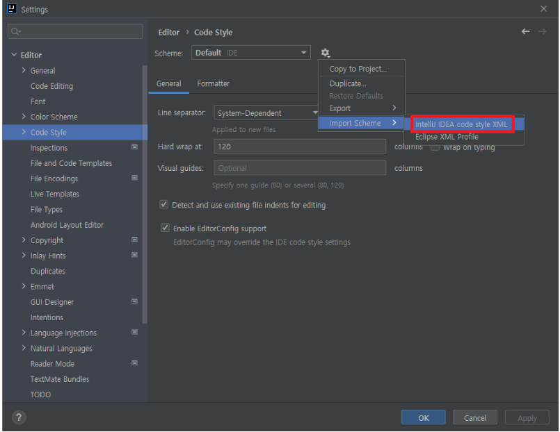
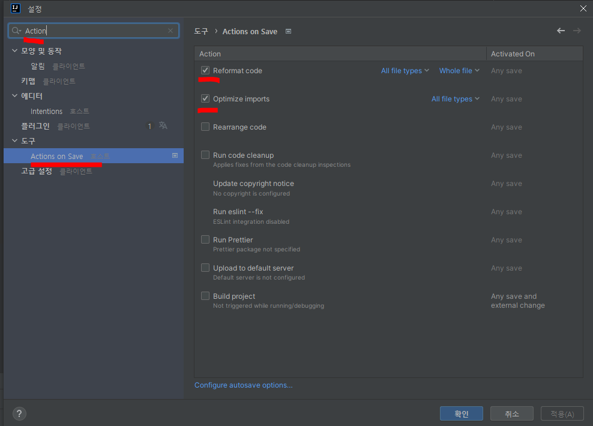
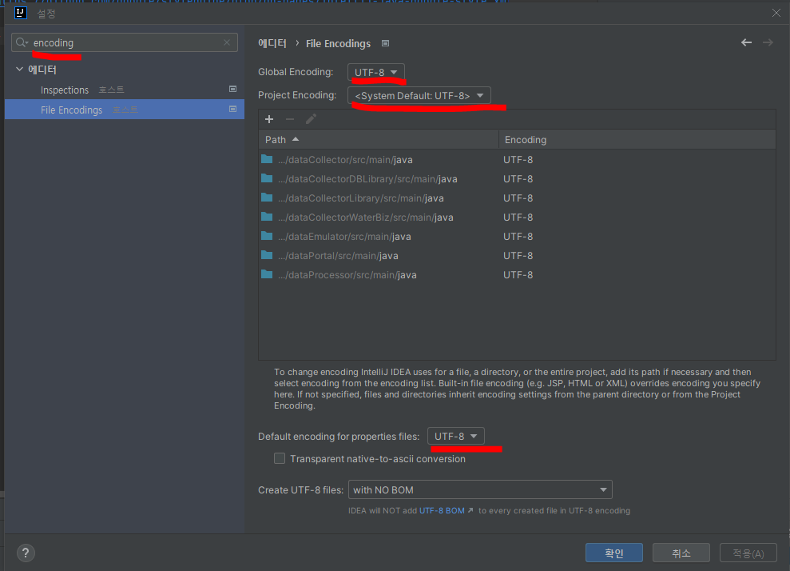

# 코드 스타일 적용 방법

### 코드 스타일 적용

- 설정 > Code Style > 톱니바퀴 > import Scheme
- code-style/Nextorm_java_convention_v0_1.xml 파일 선택

### Actions on Save 설정

- 파일을 저장할 때 수행할 액션 설정입니다. 적용한 스타일이 저장 시점에 반영되게 하기 위함입니다
- 설정 > 도구 > Actions on Save
- 아래 항목 수정
    - Reformat code 체크
    - Optimize import 체크: 사용하지 않는 import 자동제거

### 인코딩 설정

- 설정 > encoding 검색
- 우측에 밑줄 친 옵션들을 모두 UTF-8로 변경

